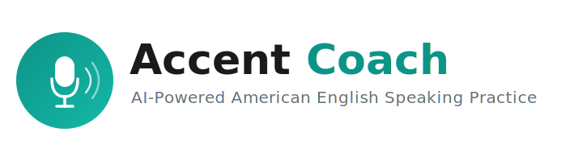
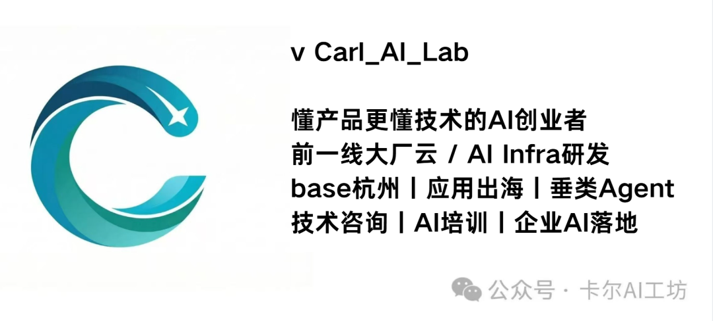

<p align="center">
  
</p>

# AI Accent Coach — AI 美式英语口语教练

自部署的 AI 口语练习工具，By **卡尔AI工坊**

支持实时对话、发音纠正、生词本和间隔重复复习

A self-hosted AI speaking coach for American English learners — real conversation practice, pronunciation coaching, vocabulary notebook, and spaced-repetition review.



---

## 功能 / Features

- **实时对话** — 与 AI 教练进行流式对话（streaming LLM）
- **语音识别** — 本地运行 [faster-whisper](https://github.com/SYSTRAN/faster-whisper)，支持 GPU / CPU，零额外 API 费用
- **语音合成** — 通过 [edge-tts](https://github.com/rany2/edge-tts) 免费朗读，无需 API Key
- **点击查词** — 点击教练回复中的任意单词，即时查看释义并自动存入生词本
- **选中查短语** — 选中一段文本获取上下文翻译
- **间隔重复复习** — 基于 Leitner Box 的生词本复习系统
- **6 种对话场景** — 日常聊天 / 商务 / 旅行 / 面试 / 讨论 / 故事
- **3 个难度等级** — 入门 / 中级 / 高级
- **单文件前端** — 无构建步骤，不依赖 Node.js

## 架构 / Architecture

```text
┌───────────────────────────────────┐
│         Browser (index.html)      │
│   mic → WebM → /api/transcribe   │
│   text → /api/chat (SSE stream)  │
│   audio ← /api/tts               │
└──────────────┬────────────────────┘
               │ HTTPS（自签名证书 / self-signed）
┌──────────────▼────────────────────┐
│          FastAPI backend          │
│  ┌──────────┐  ┌───────────────┐  │
│  │ Whisper  │  │ OpenAI-compat │  │
│  │ (本地)   │  │   LLM API     │  │
│  └──────────┘  └───────────────┘  │
│  ┌──────────┐  ┌───────────────┐  │
│  │ edge-tts │  │ JSON 存储     │  │
│  └──────────┘  └───────────────┘  │
└───────────────────────────────────┘
```

## 目录结构 / Directory Structure

```text
ai-accent-coach/
├── app.py              # FastAPI 后端（所有 API）
├── coach.sh            # 服务管理脚本（start/stop/restart/status/log）
├── requirements.txt
├── .env.example        # ← 复制为 .env 并填写配置
├── static/
│   └── index.html      # 单文件前端
└── assets/
    └── logo.png
```

## 快速开始 / Quick Start

```bash
git clone https://github.com/Carl-AI-Lab/ai-accent-coach.git
cd ai-accent-coach

python3 -m venv venv && source venv/bin/activate   # 推荐使用虚拟环境
pip install -r requirements.txt

cp .env.example .env
# 编辑 .env —— 至少填写 OPENAI_API_KEY
# 没有 GPU？把 WHISPER_DEVICE 改为 cpu
```

启动服务 / Start：

```bash
bash coach.sh start          # 后台运行，日志输出到 accent-coach.log
# 或
python app.py                # 前台运行，实时输出
```

> **首次启动说明：** Whisper 模型（distil-large-v3 约 1.5 GB）会在首次使用时自动从 HuggingFace 下载，请耐心等待。国内用户可在 `.env` 中取消 `HF_ENDPOINT` 的注释以使用镜像加速。

打开浏览器访问 **https://localhost:8443**。

> 由于使用自签名证书，浏览器会显示安全警告——点击 **"高级"→"继续前往"**（Chrome）或 **"接受风险并继续"**（Firefox）即可。

停止服务 / Stop：

```bash
bash coach.sh stop
```

## 环境变量 / Configuration

所有配置项均在 **`.env`** 文件中（参考 [.env.example](.env.example)）：

| 变量 Variable | 默认值 Default | 说明 Description |
|---|---|---|
| `OPENAI_API_KEY` | *（必填 required）* | 任意 OpenAI 兼容服务的 API Key |
| `OPENAI_BASE_URL` | `https://api.openai.com/v1` | LLM 接口地址，支持 OpenAI / DeepSeek / Ollama 等 |
| `LLM_MODEL` | `gpt-4.1-mini` | 模型名称 |
| `WHISPER_DEVICE` | `cpu` | `cuda` = GPU，`cpu` = 仅 CPU |
| `WHISPER_MODEL` | `distil-large-v3` | Whisper 模型大小 |
| `WHISPER_UNLOAD_TIMEOUT` | `120` | 空闲多少秒后自动卸载模型（节省显存） |
| `TTS_VOICE` | `en-US-AndrewMultilingualNeural` | edge-tts 语音名称 |
| `PORT` | `8443` | HTTPS 监听端口 |

### 切换 LLM 服务商 / Using a Different LLM Provider

支持任意 OpenAI 兼容接口：

```bash
# OpenAI（默认）
OPENAI_BASE_URL=https://api.openai.com/v1
OPENAI_API_KEY=sk-...
LLM_MODEL=gpt-4.1-mini

# DeepSeek
OPENAI_BASE_URL=https://api.deepseek.com/v1
OPENAI_API_KEY=sk-...
LLM_MODEL=deepseek-chat

# Ollama（本地运行，免费）
OPENAI_BASE_URL=http://localhost:11434/v1
OPENAI_API_KEY=ollama
LLM_MODEL=llama3.1
```

## GPU 与 CPU 对比 / GPU vs CPU

Whisper 在本地运行语音识别，可选 GPU 或 CPU 模式。

### GPU 模式（推荐）

```bash
WHISPER_DEVICE=cuda
```

需要 NVIDIA GPU + **cuBLAS** + **cuDNN**（CUDA 12）。

先安装 CUDA 运行时库（如果系统未自带）：

```bash
pip install nvidia-cublas-cu12 nvidia-cudnn-cu12
```

然后设置 `LD_LIBRARY_PATH`，让 `faster-whisper` 能找到它们：

```bash
# 查找 pip 安装的库路径
python3 -c "import nvidia.cublas.lib, nvidia.cudnn.lib; print(nvidia.cublas.lib.__path__[0]); print(nvidia.cudnn.lib.__path__[0])"

# 输出示例：
#   /home/you/venv/lib/python3.11/site-packages/nvidia/cublas/lib
#   /home/you/venv/lib/python3.11/site-packages/nvidia/cudnn/lib

# 启动前设置（或取消 coach.sh 中对应行的注释）：
export LD_LIBRARY_PATH="/home/you/venv/.../nvidia/cublas/lib:/home/you/venv/.../nvidia/cudnn/lib"
```

### CPU 模式

```bash
WHISPER_DEVICE=cpu
```

无需 GPU，任何机器都能运行，但速度明显更慢——见下方性能对比。

> **提示：** 在 CPU 上建议使用较小的模型以加快响应速度：
> ```bash
> WHISPER_MODEL=base     # 最快，准确率较低
> WHISPER_MODEL=small    # 速度与准确率平衡
> WHISPER_MODEL=medium   # 准确率更高，速度更慢
> ```

### 性能实测 / Benchmark

在同一台机器上测试，10 秒音频片段，`distil-large-v3` 模型，`beam_size=5`，`vad_filter=True`：

| | 设备 Device | 计算类型 | 模型加载 | 转录耗时（3 次平均） |
|---|---|---|---|---|
| **GPU** | NVIDIA RTX 4060 Laptop (8 GB) | float16 | 16.5 s | **0.51 s** |
| **CPU** | Intel i7-12700H (20 threads) | int8 | 5.7 s | **5.52 s** |

> **CPU 转录速度约慢 11 倍**，但模型加载反而快 3 倍（跳过 CUDA 初始化）。日常练习时 CPU 延迟（~5 秒/句）可以接受；追求流畅对话体验建议使用 **GPU**。

## 环境要求 / Requirements

- Python ≥ 3.9
- 一个 OpenAI 兼容的 API Key（用于 LLM）
- *（GPU 模式）* NVIDIA GPU + CUDA 12 + cuBLAS + cuDNN 9
- *（CPU 模式）* 无额外硬件要求，x86_64 或 ARM 均可

## 许可证 / License

[Apache License 2.0](LICENSE)
